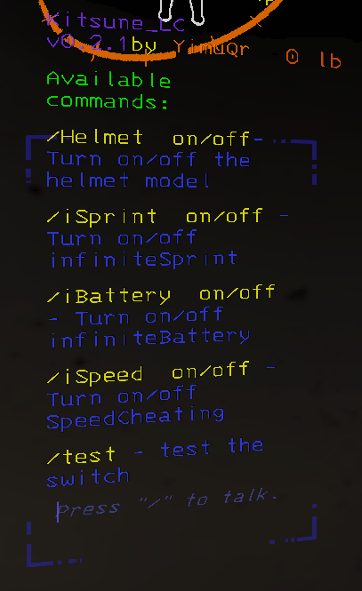

<h2 align="center"> ✨ Kitsune_LC ✨ </h2>

```zsh
> A MelonLoader mod that operates by entering commands into the game chat box for Lethal Company ⭐
```



```zsh
       _ _                            __    ___
  /\ /(_) |_ ___ _   _ _ __   ___    / /   / __\
 / //_/ | __/ __| | | | '_ \ / _ \  / /   / /
/ __ \| | |_\__ \ |_| | | | |  __/ / /___/ /___
\/  \/|_|\__|___/\__,_|_| |_|\___| \____/\____/

>>> Type /help in game chat box to start
```

```zsh
> /Helmet  on/off - Turn on/off the helmet model  ⭐

> /iSpeed  on/off - Turn on/off SpeedCheating  ⭐

> /iBattery  on/off - Turn on/off infiniteBattery  ⭐

> /iSprint  on/off - Turn on/off infiniteSprint  ⭐
```

```zsh
> and.. A feature that transmits received damage to Xtoy
```

🔗 Xtoy script: [XToys Lethal Company OSC to DG](https://xtoys.app/scripts/-NFYo-8Dy4iVKGB8DR3U)

<h2 align="center"> 🧡 END 🧡 </h2>
